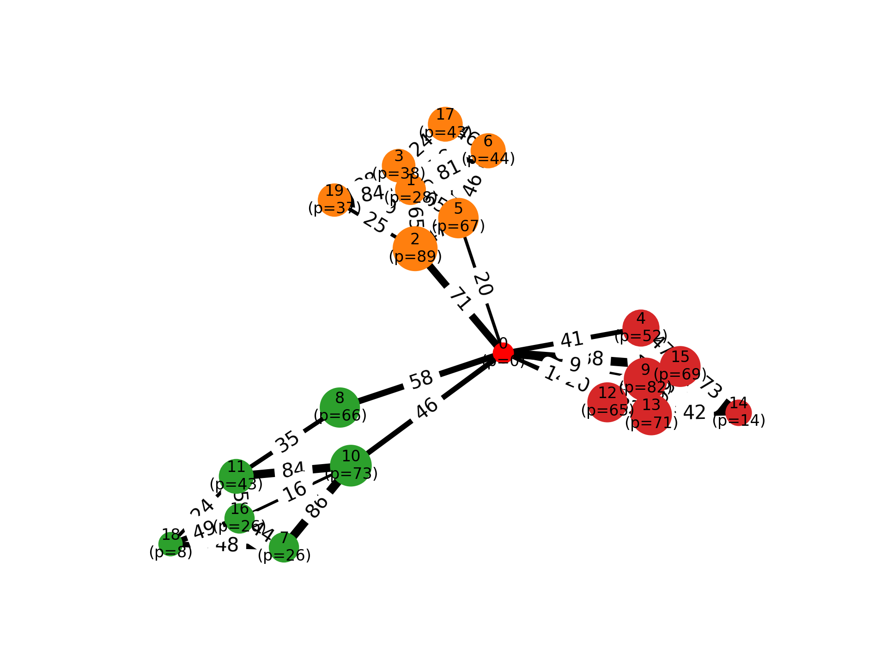

# Repo for bi-objective TSP

This repository consists of the Python implementation of the code used in the paper "A Decomposition Framework for Bi-Objective Travelling Salesman Problems with Profits".

 

# Project structure

The repository is organized as follows:

```text
.
├── apps/                    # Marimo dashboards for results and algorithms
├── instances/               # Input instances and experiment presets
├── results/                 # Generated CSV files, plots, and configurations
├── src/bitsp/               # Main Python package
│   ├── classes/             # Problem instances, solutions, and optimization models
│   └── utils/               # Helper functions, generators, and algorithms
├── computational_study.py   # Runs the computational experiments
├── generate_instances.py    # Generates problem instances
├── requirements.txt         # Python dependencies
└── pyproject.toml           # Package configuration

The main implementation is contained in src/bitsp, while experiment scripts, interactive Marimo applications, input instances, and generated results are kept in separate top-level directories.
```

## Installation

To install run the following commands (inside the `code` directory):

- (assuming Python3 is installed) setup venv `python3 -m venv .venv`
- Install `bitsp` package:
  - Update setuptools `python -m pip install --upgrade pip setuptools wheel`
  - Install package `pip install -e . `
- Install dependencies `pip install -r requirements.txt`.
- Install `CPLEX` to use callbacks, and solve large MIPS.
  - Inside venv go to CPLEX location and run the `setup.py`.
 - Some plots are quite large, and cannot pre shown directly. Therefore, they are saved as pdfs.
- Run `python computational_study.py` to generate new csv result file, to read in the `Marimo app`.

```
usage: computational_study.py [-h]
                              [--preset {medium,medium-sampl}]
                              [--exclude-methods EXCLUDE_METHODS [EXCLUDE_METHODS ...]] [--skip-time SKIP_TIME]
                              [--max-solution-time MAX_SOLUTION_TIME] [--reset-csv | --no-reset-csv]

Run experiments with configurable presets.

options:
  -h, --help            show this help message and exit
  --preset {.DS_Store,large,seed-test,medium,small,medium-sample,small-test,large-test,test_comp_study,medium-test}, -p {.DS_Store,l
arge
,seed-test,medium,small,medium-sample,small-test,large-test,test_comp_study,medium-test}
                        Experiment preset to use (default: medium).
  --exclude-methods EXCLUDE_METHODS [EXCLUDE_METHODS ...]
                        Methods to exclude (space-separated).
  --skip-time SKIP_TIME
                        Skip time in seconds (default: 60).
  --max-solution-time MAX_SOLUTION_TIME
                        Kill solver after this many seconds. Defaults to skip_time + 2.
  --reset-csv, --no-reset-csv
                        Reset CSV files before running (default: True). (default: False)
  --no-skip
                        Ignores the skipping rule.
```


# Instances

A larger preset of instances generated for this project can be found in the repository [MOrepo-Lyngesen26b](https://github.com/MCDMSociety/MOrepo-Lyngesen26b). 

# Results

- Run Marimo dashboard app with `Marimo edit apps/dataview.py` - shows the numbers, tables and plots used in the paper.
- Run Marimo dashboard app with `Marimo edit apps/algorithms.py` - showcases the algorithms in the implementation in an interactive notebook.
